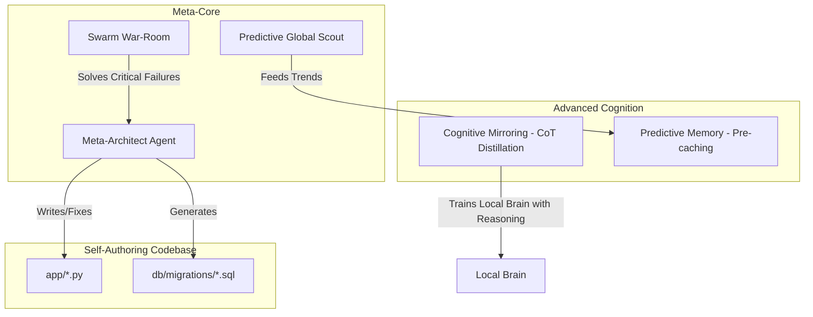

# Plan: ATRA Singularity v3.0 - Autonomous Meta-Architecture

This plan pushes ATRA beyond predefined limits, enabling the system to modify its own codebase, predict user needs before they are articulated, and leverage swarm intelligence for complex debugging.

## Meta-Intelligence Architecture

## Advanced Strategies

### 1. Meta-Architect Agent (Self-Authoring)

Create [`knowledge_os/app/meta_architect.py`](knowledge_os/app/meta_architect.py).

- This agent is granted the authority to read the entire codebase and write new modules or patch existing ones.
- When the **Self-Repair Engine** (Phase 8) identifies a code-level bug, the Meta-Architect will attempt to fix it and run a test cycle before committing.

### 2. Cognitive Mirroring (Reasoning Distillation)

Upgrade [`knowledge_os/app/distillation_engine.py`](knowledge_os/app/distillation_engine.py).

- Instead of distilling only the `assistant_response`, we will require Cloud LLMs to provide a hidden "Reasoning Trace" (Chain of Thought).
- The Local Brain will be fine-tuned on these traces, enabling it to "think" like GPT-4, not just mimic its output.

### 3. Predictive Pre-caching & Global Scouting

Enhance [`knowledge_os/app/global_scout.py`](knowledge_os/app/global_scout.py) and [`knowledge_os/app/semantic_cache.py`](knowledge_os/app/semantic_cache.py).

- Proactive Scouting: The Scout monitors AI and Tech news feeds.
- Predictive Synthesis: Based on news, it generates and caches answers to questions the user hasn't asked yet (e.g., "How does the new Llama-4 affect our L1?").

### 4. Swarm War-Room (Dynamic Collaboration)

Implement a dynamic collaboration protocol in [`knowledge_os/app/ai_core.py`](knowledge_os/app/ai_core.py).

- For `urgent` tasks or repeated failures, the Orchestrator will spawn a "Swarm" of 3-5 experts.
- They will communicate via a temporary Redis channel to reach a consensus, combining their specific department expertise (ML, Risk, Strategy).

## Implementation Path

- [`knowledge_os/app/meta_architect.py`](knowledge_os/app/meta_architect.py) (New: Core self-writing logic)