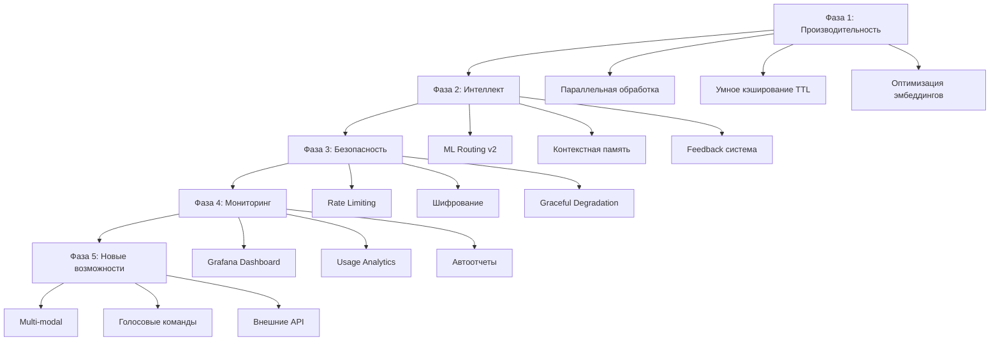

# Singularity 8.0: Полный план реализации

## Обзор

План включает 15 основных задач, разбитых на 5 фаз. Каждая фаза фокусируется на определенной области улучшений с четкими метриками успеха.

## Архитектура улучшений

## Фаза 1: Производительность и оптимизация (1-2 недели)

### Задача 1.1: Параллельная обработка запросов

**Цель:** Уменьшить latency на 40-60% через параллельную обработку**Файлы:**

- `knowledge_os/app/parallel_request_processor.py` (новый)
- `knowledge_os/app/ai_core.py` (интеграция в `run_smart_agent_async`)

**Реализация:**

1. Создать `ParallelRequestProcessor` класс с пулом воркеров
2. Использовать `asyncio.Semaphore` для ограничения параллелизма
3. Параллельно проверять кэш, локальные модели и облако
4. Интегрировать в `ai_core.py` для одновременных запросов к разным источникам

**Метрики:**

- Latency p95 < 2 секунды
- Параллелизм: до 5 одновременных запросов

### Задача 1.2: Умное кэширование с TTL и приоритетами

**Цель:** Увеличить cache hit rate на 20-30%**Файлы:**

- `knowledge_os/app/semantic_cache.py` (добавить TTL и приоритеты)
- `knowledge_os/db/migrations/add_cache_ttl_priorities.sql` (новый)
- `knowledge_os/app/ai_core.py` (интеграция приоритетов)

**Реализация:**

1. Добавить колонки `ttl_seconds`, `priority`, `expires_at` в `semantic_ai_cache`
2. Реализовать автоматическую очистку устаревших записей
3. Приоритеты: critical (7 дней), high (3 дня), medium (1 день), low (6 часов)
4. Фоновая задача очистки каждые 30 минут

**Метрики:**

- Cache hit rate > 70%
- Автоочистка устаревших записей

### Задача 1.3: Оптимизация эмбеддингов

**Цель:** Ускорить поиск в кэше на 50-70%**Файлы:**

- `knowledge_os/app/embedding_optimizer.py` (новый)
- `knowledge_os/app/semantic_cache.py` (интеграция кэширования эмбеддингов)
- `knowledge_os/db/migrations/add_embedding_cache.sql` (новый)

**Реализация:**

1. Кэшировать эмбеддинги для похожих запросов (normalized text)
2. Batch-обработка: собирать несколько запросов и обрабатывать вместе
3. Использовать более быструю модель для эмбеддингов (nomic-embed-text уже используется)
4. Таблица `embedding_cache` для хранения эмбеддингов

**Метрики:**

- Время генерации эмбеддинга < 100ms
- Cache hit rate для эмбеддингов > 60%

## Фаза 2: Интеллектуальные улучшения (2-3 недели)

### Задача 2.1: ML-based Intelligent Routing v2

**Цель:** Улучшить качество ответов на 15-25%**Файлы:**

- `knowledge_os/app/ml_router_v2.py` (новый)
- `knowledge_os/app/ml_router_trainer.py` (новый)
- `knowledge_os/db/migrations/add_ml_routing_data.sql` (новый)
- `knowledge_os/app/ai_core.py` (интеграция ML роутера)

**Реализация:**

1. Создать таблицу `ml_routing_training_data` для сбора данных
2. Обучение модели на исторических данных (качество ответов, latency, cost)
3. Features: длина запроса, категория, время дня, доступность моделей
4. A/B тестирование: сравнение ML роутинга с правилами
5. Интеграция в `ai_core.py` для предсказания оптимального роутинга

**Метрики:**

- Accuracy предсказания роутинга > 80%
- Улучшение качества ответов на 15-25%

### Задача 2.2: Контекстная память между запросами

**Цель:** Улучшить качество диалогов на 30-40%**Файлы:**

- `knowledge_os/app/session_context_manager.py` (новый)
- `knowledge_os/db/migrations/add_session_context.sql` (новый)
- `knowledge_os/app/ai_core.py` (интеграция контекста)
- `knowledge_os/app/telegram_simple.py` (передача session_id)

**Реализация:**

1. Таблица `session_context` для хранения контекста сессий
2. Автоматическое извлечение релевантного контекста из предыдущих запросов
3. Ограничение контекста: последние 10 запросов в сессии
4. TTL для сессий: 24 часа неактивности
5. Интеграция в `run_smart_agent_async` для добавления контекста к промпту

**Метрики:**

- Улучшение качества диалогов на 30-40%
- Средний размер контекста < 500 токенов

### Задача 2.3: Автоматическое улучшение промптов на основе feedback

**Цель:** Постоянное улучшение качества ответов**Файлы:**

- `knowledge_os/app/feedback_collector.py` (улучшение: добавить сохранение в БД)
- `knowledge_os/app/auto_prompt_optimizer.py` (улучшение: анализ feedback)
- `knowledge_os/app/telegram_simple.py` (добавить кнопки 👍/👎)
- `knowledge_os/db/migrations/add_feedback_system.sql` (новый)

**Реализация:**

1. Таблица `user_feedback` для хранения оценок
2. Inline кнопки в Telegram: 👍 (positive) и 👎 (negative)
3. Анализ успешных/неуспешных ответов: извлечение паттернов
4. Генерация улучшенных версий промптов на основе feedback
5. A/B тестирование новых промптов

**Метрики:**

- Сбор feedback > 20% запросов
- Улучшение качества ответов на основе feedback

## Фаза 3: Безопасность и надежность (1-2 недели)

### Задача 3.1: Rate Limiting и защита от злоупотреблений

**Цель:** Защита от DDoS и злоупотреблений**Файлы:**

- `knowledge_os/app/rate_limiter.py` (новый)
- `knowledge_os/app/threat_detector.py` (улучшение: интеграция rate limiting)
- `knowledge_os/app/telegram_simple.py` (интеграция rate limiter)
- `knowledge_os/db/migrations/add_rate_limiting.sql` (новый)

**Реализация:**

1. Таблица `rate_limits` для отслеживания запросов по пользователям
2. Лимиты: 30 запросов в минуту, 500 в час
3. Защита от спама: блокировка повторяющихся одинаковых запросов
4. Автоматическая блокировка подозрительных пользователей (более 1000 запросов/час)
5. Интеграция в `telegram_simple.py` перед обработкой запроса

**Метрики:**

- Блокировка > 95% спам-запросов
- Ложные срабатывания < 1%

### Задача 3.2: Шифрование чувствительных данных

**Цель:** Улучшение безопасности хранения секретов**Файлы:**

- `knowledge_os/app/secret_manager.py` (новый)
- `knowledge_os/app/config_manager.py` (улучшение: использование SecretManager)
- `knowledge_os/db/migrations/add_encrypted_secrets.sql` (новый)

**Реализация:**

1. Использование `cryptography` для шифрования секретов
2. Таблица `encrypted_secrets` для хранения зашифрованных ключей
3. Мастер-ключ из environment variable
4. Ротация ключей: автоматическая генерация новых ключей
5. Миграция существующих секретов на шифрование

**Метрики:**

- Все секреты зашифрованы
- Ротация ключей каждые 90 дней

### Задача 3.3: Graceful Degradation при сбоях

**Цель:** Улучшение uptime на 20-30%**Файлы:**

- `knowledge_os/app/disaster_recovery.py` (улучшение: изоляция сбоев)
- `knowledge_os/app/circuit_breaker.py` (улучшение: graceful fallback)
- `knowledge_os/app/ai_core.py` (интеграция graceful degradation)

**Реализация:**

1. Изоляция сбоев: один компонент не влияет на другие
2. Автоматическое переключение на резервные компоненты
3. Минимальный функционал при частичных сбоях (read-only mode)
4. Приоритеты компонентов: критичные vs некритичные
5. Логирование всех fallback операций

**Метрики:**

- Uptime > 99.5%
- Время восстановления < 30 секунд

## Фаза 4: Мониторинг и аналитика (1-2 недели)

### Задача 4.1: Real-time Dashboard (Grafana)

**Цель:** Улучшение observability через визуализацию**Файлы:**

- `knowledge_os/dashboard/grafana_dashboard.json` (новый)
- `knowledge_os/app/metrics_exporter.py` (новый)
- `knowledge_os/app/enhanced_monitor.py` (интеграция экспорта метрик)

**Реализация:**

1. Prometheus exporter для метрик
2. Grafana dashboard с панелями:

- Latency (p50, p95, p99)
- Cache hit rate
- Token usage и savings
- Error rate
- Model performance

3. Real-time обновление каждые 5 секунд
4. Алерты в Grafana при превышении порогов

**Метрики:**

- Все ключевые метрики визуализированы
- Dashboard обновляется в реальном времени

### Задача 4.2: Детальная аналитика использования

**Цель:** Понимание паттернов использования системы**Файлы:**

- `knowledge_os/app/usage_analytics.py` (новый)
- `knowledge_os/db/migrations/add_usage_analytics.sql` (новый)
- `knowledge_os/app/enhanced_monitor.py` (интеграция аналитики)

**Реализация:**

1. Таблицы для аналитики:

- `user_analytics` (топ запросы, частота использования)
- `expert_analytics` (популярность экспертов)
- `model_analytics` (эффективность моделей)

2. Автоматический сбор данных при каждом запросе
3. Агрегация данных каждые 5 минут
4. API endpoints для получения аналитики

**Метрики:**

- Сбор данных для 100% запросов
- Агрегация данных в реальном времени

### Задача 4.3: Автоматические отчеты

**Цель:** Проактивное управление системой**Файлы:**

- `knowledge_os/app/report_generator.py` (новый)
- `knowledge_os/app/enhanced_monitor.py` (интеграция генерации отчетов)
- `knowledge_os/app/telegram_alerter.py` (отправка отчетов)

**Реализация:**

1. Ежедневные отчеты: статистика за день, топ проблемы
2. Еженедельные отчеты: тренды, рекомендации по улучшению
3. Автоматический анализ трендов: рост/падение метрик
4. Предупреждения о проблемах: автоматические алерты
5. Отправка отчетов в Telegram

**Метрики:**

- Отчеты генерируются автоматически
- Время генерации отчета < 10 секунд

## Фаза 5: Новые возможности (2-3 недели)

### Задача 5.1: Multi-modal поддержка (изображения, файлы)

**Цель:** Расширение возможностей системы**Файлы:**

- `knowledge_os/app/vision_processor.py` (улучшение: интеграция Moondream)
- `knowledge_os/app/file_processor.py` (новый)
- `knowledge_os/app/telegram_simple.py` (обработка изображений и файлов)

**Реализация:**

1. Обработка изображений через Moondream (уже есть в системе)
2. Обработка PDF: извлечение текста через `pypdf` или `pdfplumber`
3. Обработка других файлов: текстовые форматы
4. Интеграция в `telegram_simple.py` для обработки вложений
5. Сохранение обработанных данных в контекст запроса

**Метрики:**

- Поддержка изображений (JPEG, PNG)
- Поддержка PDF файлов
- Время обработки < 5 секунд

### Задача 5.2: Голосовые команды

**Цель:** Улучшение UX через голосовой ввод**Файлы:**

- `knowledge_os/app/voice_processor.py` (новый)
- `knowledge_os/app/telegram_simple.py` (обработка голосовых сообщений)

**Реализация:**

1. Speech-to-Text: использование OpenAI Whisper API или локальной модели
2. Text-to-Speech: синтез речи для ответов
3. Обработка голосовых сообщений в Telegram
4. Кэширование распознанного текста

**Метрики:**

- Точность распознавания > 90%
- Время обработки голосового сообщения < 10 секунд

### Задача 5.3: Интеграция с внешними API

**Цель:** Более точные и актуальные ответы**Файлы:**

- `knowledge_os/app/external_api_integration.py` (новый)
- `knowledge_os/app/ai_core.py` (интеграция внешних источников)

**Реализация:**

1. GitHub API: поиск кода и примеров
2. Stack Overflow API: поиск решений проблем
3. Документация библиотек: парсинг официальной документации
4. Интеграция в `run_smart_agent_async` для дополнения ответов внешними данными
5. Кэширование результатов внешних запросов

**Метрики:**

- Улучшение качества ответов на 10-15%
- Время запроса к внешним API < 3 секунд

## Быстрые победы (Quick Wins)

Эти задачи можно выполнить параллельно с основными фазами:

1. **Кнопки feedback (👍/👎)** - 1 час

- `knowledge_os/app/telegram_simple.py` (добавить inline кнопки)
- `knowledge_os/app/feedback_collector.py` (обработка callback)

2. **Health check endpoint** - 1 час

- `knowledge_os/app/health_check.py` (новый)
- Простой HTTP endpoint `/health` для мониторинга

3. **Улучшение логирования** - 2 часа

- Добавить request ID для трейсинга
- Структурированное логирование (JSON format)

4. **Оптимизация SQL запросов** - 2 часа

- Добавить индексы в `semantic_ai_cache`
- Оптимизировать медленные запросы

5. **Метрики в Prometheus** - 3 часа

- `knowledge_os/app/metrics_exporter.py` (базовая версия)
- Экспорт метрик в формате Prometheus

## Метрики успеха

### Производительность:

- Latency p95 < 2 секунды
- Cache hit rate > 70%
- Uptime > 99.5%

### Качество:

- User satisfaction > 85%
- Response quality score > 4.0/5.0
- Error rate < 1%

### Экономика токенов:

- Token savings > 60%
- Cost per request < $0.01

## Зависимости между задачами

