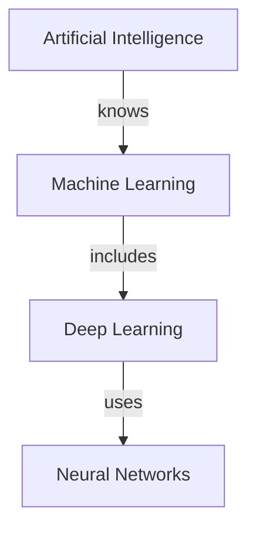

# Knowledge Graph Skill

## Когда использовать

- Анализ связей между концепциями
- Визуализация данных
- Relationship discovery
- Semantic search

## Основные концепции

### Graph Structure

```
Nodes: Сущности (Users, Products, etc)
Edges: Отношения (knows, buys, uses)
Properties: Атрибуты узлов и связей
```

### Примеры

#### Personal Knowledge Graph

```
User → knows → Concept → related_to → Concept
```

#### Company Knowledge Graph

```
Employee → works_in → Department
Employee → reports_to → Employee
Project → uses → Technology
Project → owned_by → Team
```

## Построение графа

### Step 1: Extract Entities

```python
def extract_entities(text):
    # NER or keyword extraction
    entities = ner.extract(text)
    return entities
```

### Step 2: Extract Relations

```python
def extract_relations(text):
    # Relation extraction
    relations = re.findall(r"(\w+) → (\w+) → (\w+)", text)
    return [(s, r, t) for s, r, t in relations]
```

### Step 3: Build Graph

```python
import networkx as nx

G = nx.DiGraph()

for entity in entities:
    G.add_node(entity['id'], **entity)

for relation in relations:
    G.add_edge(relation['source'], relation['target'],
               type=relation['type'])
```

## Query Patterns

### Shortest Path

```python
# Find path between two concepts
path = nx.shortest_path(G, source="AI", target="ML")
```

### Common Neighbors

```python
# Find common neighbors
neighbors = set(G["A"].keys()) & set(G["B"].keys())
```

### Centrality

```python
# Find most important nodes
centrality = nx.degree_centrality(G)
top = sorted(centrality.items(), key=lambda x: x[1], reverse=True)[:10]
```

## Visualization

### Text Output

```
AI → knows → Machine Learning
Machine Learning → subtype_of → AI
Deep Learning → related_to → Machine Learning
Neural Network → related_to → Deep Learning
```

### Mermaid Diagram



### Graph Formats

- **Adjacency List** - для JSON
- **GraphML** - для Cytoscape/Gephi
- **Neo4j** - для базы данных
- **Turtle** - для RDF

## Инструменты

### Python Libraries

- `networkx` - graph operations
- `rdflib` - RDF graphs
- `py2neo` - Neo4j integration
- `gralej` - visualization

## Output Format

```json
{
  "nodes": [
    { "id": "AI", "type": "concept" },
    { "id": "ML", "type": "concept" }
  ],
  "edges": [{ "source": "AI", "target": "ML", "type": "knows" }]
}
```
