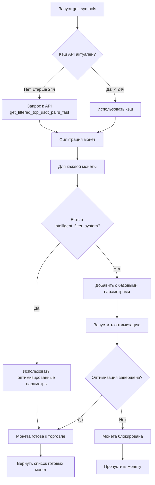

# Автоподбор монет из API с автоматической оптимизацией

**Дата:** 2025-12-14  
**Версия:** 1.0

---

## Описание

Система автоматически получает список монет из API (раз в сутки), проверяет наличие оптимизированных параметров в `intelligent_filter_system`, и для новых монет запускает автоматическую оптимизацию. Торговля блокируется до завершения оптимизации.

## Архитектура



## Приоритеты отбора монет

### ПРИОРИТЕТ 0: Авто-подбор из API (основной источник)

**Источник:** `get_filtered_top_usdt_pairs_fast(top_n=500, final_limit=200)`

**Кэширование:**
- Список монет кэшируется на 24 часа
- Обновляется автоматически при следующем вызове после истечения TTL
- Можно принудительно обновить через `force_refresh_api_coins_cache()`

**Процесс:**
1. Получение списка монет из API (или из кэша)
2. Фильтрация стейблкоинов и дублей
3. Для каждой монеты:
   - Проверка наличия в `intelligent_filter_system`
   - Если есть - использование оптимизированных параметров
   - Если нет - добавление с базовыми параметрами и запуск оптимизации
4. Возврат только готовых монет (оптимизированных)

**Результат:** До 200 монет (после фильтрации)

---

### ПРИОРИТЕТ 1: intelligent_filter_system (fallback)

**Условие:** Если API недоступен или вернул пустой список

**Источник:** `src/ai/intelligent_filter_system.py` → `get_all_optimized_symbols()`

**Результат:** ~141 монета с оптимизированными параметрами

---

### ПРИОРИТЕТ 2: COINS из config.py (fallback)

**Условие:** Если `AUTO_FETCH_COINS=False` и `COINS` задан

**Результат:** 22 монеты из конфигурации

---

### FALLBACK: Жестко заданный список

**Условие:** Если все источники недоступны

**Список:** BTCUSDT, ETHUSDT, BNBUSDT, SNXUSDT, DASHUSDT, NEARUSDT

---

## Процесс оптимизации новых монет

### Шаг 1: Обнаружение новой монеты

Когда монета из API не найдена в `intelligent_filter_system`:

```python
if symbol not in optimized_symbols:
    logger.info("🆕 [%s] Новая монета, добавляем с базовыми параметрами и запускаем оптимизацию", symbol)
    params, is_ready = await params_manager.ensure_symbol_optimized(symbol)
```

### Шаг 2: Добавление с базовыми параметрами

Монета добавляется в файл параметров с базовыми значениями:

```python
DEFAULT_PARAMS = {
    "volume_ratio": 0.4,
    "rsi_oversold": 40,
    "rsi_overbought": 60,
    "trend_strength": 0.15,
    "quality_score": 0.65,
    "momentum_threshold": -5.0
}
```

### Шаг 3: Запуск оптимизации

Оптимизация запускается в фоновом режиме (не блокирует систему):

```python
if not self._check_lock_file(symbol):
    asyncio.create_task(self._run_optimization(symbol))
```

### Шаг 4: Блокировка торговли

Монета **блокируется** до завершения оптимизации:

```python
if is_ready:
    ready_symbols.append(symbol)  # Готова к торговле
else:
    pending_symbols.append(symbol)  # Заблокирована
```

### Шаг 5: Автоматическое разблокирование

После завершения оптимизации монета автоматически становится доступной при следующем вызове `get_symbols()`.

---

## Кэширование списка монет из API

### Глобальные переменные

```python
_api_coins_cache: Optional[List[str]] = None
_api_coins_cache_timestamp: Optional[float] = None
API_COINS_CACHE_TTL = 86400  # 24 часа в секундах
```

### Функция кэширования

```python
async def get_cached_api_coins() -> List[str]:
    """Получает монеты из API с кэшированием на 24 часа"""
    # Проверка кэша
    if кэш_актуален:
        return кэш
    
    # Обновление кэша
    symbols = await get_filtered_top_usdt_pairs_fast(...)
    _api_coins_cache = symbols
    _api_coins_cache_timestamp = time.time()
    return symbols
```

### Принудительное обновление

```python
def force_refresh_api_coins_cache():
    """Принудительно обновляет кэш монет из API"""
    _api_coins_cache = None
    _api_coins_cache_timestamp = None
```

---

## Логирование

### Примеры логов

**Обновление кэша:**
```
🔄 Обновление списка монет из API...
✅ Список монет из API обновлен и закэширован (187 монет)
```

**Использование кэша:**
```
✅ Используем кэшированный список монет из API (187 монет)
```

**Новая монета:**
```
🆕 [NEWCOINUSDT] Новая монета, добавляем с базовыми параметрами и запускаем оптимизацию
⏳ [NEWCOINUSDT] Оптимизация запущена, монета заблокирована до завершения
```

**Оптимизация в процессе:**
```
⏳ [NEWCOINUSDT] Оптимизация в процессе (запущена 15 минут назад)
```

**Монета готова:**
```
✅ [NEWCOINUSDT] Оптимизация завершена, монета готова
✅ [NEWCOINUSDT] Используем оптимизированные параметры из intelligent_filter_system
```

**Итоговый результат:**
```
✅ Готово 142 монет для генерации сигналов (из 187 API, 45 в оптимизации)
```

---

## FAQ

### 1. Как часто обновляется список монет из API?

**Ответ:** Раз в сутки (24 часа). Список кэшируется и обновляется автоматически при следующем вызове после истечения TTL.

### 2. Что происходит с монетами во время оптимизации?

**Ответ:** Монеты **блокируются** и не участвуют в генерации сигналов до завершения оптимизации.

### 3. Можно ли принудительно обновить список монет?

**Ответ:** Да, через функцию `force_refresh_api_coins_cache()`.

### 4. Что если API недоступен?

**Ответ:** Система использует fallback на `intelligent_filter_system` или `COINS` из конфигурации.

### 5. Сколько времени занимает оптимизация?

**Ответ:** Зависит от монеты и объема данных. Обычно от 10 минут до нескольких часов. Прогресс логируется.

### 6. Что если оптимизация провалилась?

**Ответ:** Монета будет использовать базовые параметры и станет доступной для торговли.

### 7. Как расширяется список оптимизированных монет?

**Ответ:** Автоматически. Каждая новая монета из API добавляется, оптимизируется, и после завершения оптимизации становится доступной. Список оптимизированных монет постоянно растет.

---

## Конфигурация

### config.py

```python
# 🔧 НОВАЯ ЛОГИКА (2025-12-14):
# - Авто-подбор из API (раз в сутки) - основной источник монет
# - Монеты без оптимизированных параметров добавляются и оптимизируются
# - Торговля блокируется до завершения оптимизации
# - intelligent_filter_system используется как источник оптимизированных параметров
AUTO_FETCH_COINS = os.getenv("AUTO_FETCH_COINS", "true")
```

### Переменные окружения

- `AUTO_FETCH_COINS=true` - включить авто-подбор (по умолчанию)
- `AUTO_FETCH_COINS=false` - использовать COINS из config.py

---

## Преимущества новой системы

1. **Автоматическое расширение:** Список оптимизированных монет постоянно растет
2. **Актуальность:** Список монет обновляется раз в сутки из API
3. **Качество:** Только оптимизированные монеты участвуют в торговле
4. **Надежность:** Множественные fallback на случай недоступности API
5. **Прозрачность:** Детальное логирование всех этапов процесса

---

## Технические детали

### Файлы

- `signal_live.py` - функция `get_symbols()` и `get_cached_api_coins()`
- `src/ai/symbol_params_manager.py` - функция `ensure_symbol_optimized()`
- `src/ai/intelligent_filter_system.py` - функция `get_all_optimized_symbols()`
- `src/strategies/pair_filtering.py` - функция `get_filtered_top_usdt_pairs_fast()`
- `config.py` - переменная `AUTO_FETCH_COINS`

### Зависимости

- `asyncio` - для асинхронных операций
- `time` - для работы с временными метками кэша
- `src.strategies.pair_filtering` - для получения монет из API
- `src.ai.symbol_params_manager` - для управления параметрами и оптимизацией
- `src.ai.intelligent_filter_system` - для проверки оптимизированных монет

---

**Дата создания:** 2025-12-14  
**Статус:** ✅ Реализовано

