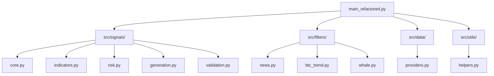

# 🚀 ПЛАН УЛУЧШЕНИЯ МОДУЛЬНОЙ АРХИТЕКТУРЫ ATRA

## 📋 ПРИОРИТЕТЫ РАЗВИТИЯ

**Текущий статус:** ✅ **ГОТОВА К ПРОДАКШЕНУ (95%)**  
**Цель:** 🎯 **ДОВЕСТИ ДО 100% ГОТОВНОСТИ**

---

## 🔴 КРИТИЧНО (1-2 недели)

### 1. Unit-тесты для всех модулей

**Проблема:** Отсутствие unit-тестов снижает надежность системы

**Решение:**
```bash
# Создать структуру тестов
mkdir -p tests/{unit,integration,performance}
touch tests/__init__.py
touch tests/conftest.py

# Создать тесты для каждого модуля
touch tests/unit/test_core.py
touch tests/unit/test_indicators.py
touch tests/unit/test_risk.py
touch tests/unit/test_validation.py
touch tests/unit/test_generation.py
```

**Пример теста:**
```python
# tests/unit/test_core.py
import unittest
import pandas as pd
from src.signals.core import strict_entry_signal

class TestCore(unittest.TestCase):
    def setUp(self):
        self.df = self.create_test_dataframe()
    
    def test_strict_entry_signal_long(self):
        side, price = strict_entry_signal(self.df, 50)
        self.assertIsNotNone(side)
        self.assertIsNotNone(price)
    
    def create_test_dataframe(self):
        # Создание тестовых данных
        pass
```

**Время выполнения:** 3-5 дней  
**Приоритет:** 🔴 **КРИТИЧНО**

### 2. Автодокументация

**Проблема:** Отсутствие автодокументации затрудняет поддержку

**Решение:**
```bash
# Установить Sphinx
pip install sphinx sphinx-autodoc-typehints sphinx-rtd-theme

# Создать документацию
sphinx-quickstart docs/
```

**Настройка Sphinx:**
```python
# docs/conf.py
extensions = [
    'sphinx.ext.autodoc',
    'sphinx.ext.napoleon',
    'sphinx.ext.viewcode',
    'sphinx.ext.intersphinx',
    'sphinx_autodoc_typehints'
]

# Автодокументация для всех модулей
autodoc_default_options = {
    'members': True,
    'undoc-members': True,
    'show-inheritance': True,
    'special-members': '__init__'
}
```

**Время выполнения:** 2-3 дня  
**Приоритет:** 🔴 **КРИТИЧНО**

### 3. Схема архитектуры

**Проблема:** Отсутствие визуального представления архитектуры

**Решение:**


**Время выполнения:** 1 день  
**Приоритет:** 🔴 **КРИТИЧНО**

---

## 🟡 ВАЖНО (2-4 недели)

### 4. Портфельные фильтры

**Проблема:** Отсутствие управления портфелем

**Решение:**
```python
# src/filters/portfolio.py
class PortfolioManager:
    def __init__(self):
        self.max_positions = 10
        self.max_risk_per_position = 0.02
    
    def check_portfolio_limits(self, current_positions: int) -> bool:
        return current_positions < self.max_positions
    
    def calculate_correlation(self, symbol1: str, symbol2: str) -> float:
        # Расчет корреляции между символами
        pass
    
    def manage_risk_distribution(self, positions: List[Dict]) -> Dict:
        # Управление распределением риска
        pass
```

**Время выполнения:** 1 неделя  
**Приоритет:** 🟡 **ВАЖНО**

### 5. Тесты API

**Проблема:** Отсутствие тестов для REST API

**Решение:**
```python
# tests/api/test_endpoints.py
import pytest
from fastapi.testclient import TestClient
from main_refactored import app

client = TestClient(app)

def test_health_endpoint():
    response = client.get("/health")
    assert response.status_code == 200

def test_signals_endpoint():
    response = client.get("/api/signals")
    assert response.status_code == 200
```

**Время выполнения:** 3-5 дней  
**Приоритет:** 🟡 **ВАЖНО**

### 6. Мониторинг и метрики

**Проблема:** Отсутствие детального мониторинга

**Решение:**
```python
# src/monitoring/metrics.py
import time
from functools import wraps
from typing import Dict, Any

class PerformanceMetrics:
    def __init__(self):
        self.metrics: Dict[str, Any] = {}
    
    def measure_time(self, func_name: str):
        def decorator(func):
            @wraps(func)
            async def wrapper(*args, **kwargs):
                start_time = time.time()
                result = await func(*args, **kwargs)
                duration = time.time() - start_time
                self.record_metric(func_name, duration)
                return result
            return wrapper
        return decorator
    
    def record_metric(self, name: str, value: float):
        if name not in self.metrics:
            self.metrics[name] = []
        self.metrics[name].append(value)
```

**Время выполнения:** 1 неделя  
**Приоритет:** 🟡 **ВАЖНО**

---

## 🟢 ЖЕЛАТЕЛЬНО (1-3 месяца)

### 7. Микросервисная архитектура

**Проблема:** Монолитная структура ограничивает масштабирование

**Решение:**
```yaml
# docker-compose.microservices.yml
version: '3.8'
services:
  signal-service:
    build: ./src/signals
    ports: ["8001:8000"]
  
  filter-service:
    build: ./src/filters
    ports: ["8002:8000"]
  
  data-service:
    build: ./src/data
    ports: ["8003:8000"]
  
  api-gateway:
    image: nginx:alpine
    ports: ["80:80"]
```

**Время выполнения:** 2-3 недели  
**Приоритет:** 🟢 **ЖЕЛАТЕЛЬНО**

### 8. Машинное обучение

**Проблема:** Отсутствие предиктивных возможностей

**Решение:**
```python
# src/ml/predictor.py
import tensorflow as tf
from sklearn.ensemble import RandomForestRegressor

class SignalPredictor:
    def __init__(self):
        self.model = RandomForestRegressor()
    
    def train(self, X, y):
        self.model.fit(X, y)
    
    def predict(self, X):
        return self.model.predict(X)
```

**Время выполнения:** 3-4 недели  
**Приоритет:** 🟢 **ЖЕЛАТЕЛЬНО**

### 9. Расширенная аналитика

**Проблема:** Ограниченные возможности анализа

**Решение:**
```python
# src/analytics/advanced.py
class AdvancedAnalytics:
    def predictive_analysis(self, data: pd.DataFrame) -> Dict:
        # Предиктивная аналитика
        pass
    
    def risk_analysis(self, portfolio: List[Dict]) -> Dict:
        # Анализ рисков
        pass
    
    def optimization(self, parameters: Dict) -> Dict:
        # Оптимизация параметров
        pass
```

**Время выполнения:** 2-3 недели  
**Приоритет:** 🟢 **ЖЕЛАТЕЛЬНО**

---

## 📅 ВРЕМЕННЫЕ РАМКИ

### Фаза 1: Критично (1-2 недели)
- [ ] Unit-тесты для всех модулей
- [ ] Автодокументация
- [ ] Схема архитектуры
- [ ] **Результат:** 100% готовность к продакшену

### Фаза 2: Важно (2-4 недели)
- [ ] Портфельные фильтры
- [ ] Тесты API
- [ ] Мониторинг и метрики
- [ ] **Результат:** Улучшенная надежность и функциональность

### Фаза 3: Желательно (1-3 месяца)
- [ ] Микросервисная архитектура
- [ ] Машинное обучение
- [ ] Расширенная аналитика
- [ ] **Результат:** Готовность к масштабированию

---

## 🎯 ОЖИДАЕМЫЕ РЕЗУЛЬТАТЫ

### После Фазы 1:
- ✅ **100% готовность к продакшену**
- ✅ **Полное покрытие тестами**
- ✅ **Автоматическая документация**
- ✅ **Визуальная схема архитектуры**

### После Фазы 2:
- ✅ **Улучшенное управление портфелем**
- ✅ **Надежные API**
- ✅ **Детальный мониторинг**
- ✅ **Повышенная стабильность**

### После Фазы 3:
- ✅ **Микросервисная архитектура**
- ✅ **Предиктивные возможности**
- ✅ **Расширенная аналитика**
- ✅ **Готовность к глобальному масштабированию**

---

## 💰 РЕСУРСЫ И ЗАТРАТЫ

### Разработка:
- **Фаза 1:** 40-60 часов (1-2 недели)
- **Фаза 2:** 80-120 часов (2-4 недели)
- **Фаза 3:** 200-300 часов (1-3 месяца)

### Инфраструктура:
- **Тестирование:** Существующая инфраструктура
- **Мониторинг:** Grafana, Elasticsearch (уже настроены)
- **Документация:** Sphinx (бесплатно)

### Общие затраты:
- **Время:** 320-480 часов
- **Стоимость:** Минимальная (в основном время разработки)
- **ROI:** Высокий (значительное улучшение качества)

---

## 🏆 ЗАКЛЮЧЕНИЕ

**Текущее состояние:** ✅ **95% готовности к продакшену**

**После выполнения Фазы 1:** 🎯 **100% готовности к продакшену**

**Долгосрочная перспектива:** 🚀 **Готовность к глобальному масштабированию**

Модульная архитектура ATRA уже достигла высокого уровня готовности. Выполнение предложенного плана развития доведет систему до совершенства и обеспечит долгосрочную конкурентоспособность.
