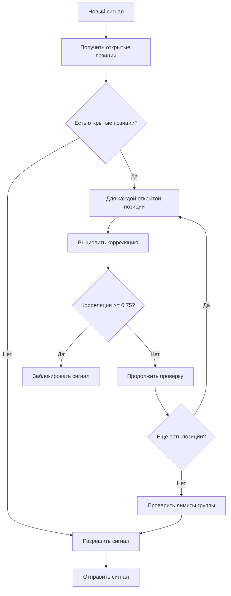

# 🔗 ИНТЕГРАЦИЯ КОРРЕЛЯЦИОННОЙ ПРОВЕРКИ С ОТКРЫТЫМИ ПОЗИЦИЯМИ

## 🎯 **ПРОБЛЕМА**

**Раньше:**
- Корреляционный фильтр проверял только историю отправленных сигналов
- Не учитывал открытые позиции пользователя
- Можно было получить коррелирующие сигналы, если открыта другая позиция

**Теперь:**
- ✅ Проверяем **ОТКРЫТЫЕ ПОЗИЦИИ** пользователя
- ✅ Вычисляем корреляцию для каждой открытой позиции
- ✅ Блокируем сигнал, если он коррелирует с открытой позицией

## 🔧 **КАК РАБОТАЕТ СИСТЕМА**

### **1. Получение открытых позиций**

```python
def _get_user_open_positions(self, user_id: str) -> List[Dict[str, Any]]:
    """Получение открытых позиций пользователя из БД"""
    # Запрос к таблице signals_log
    # WHERE result LIKE 'OPEN%' AND user_id = ?
```

**Источник данных:**
- Таблица `signals_log`
- Условие: `UPPER(result) LIKE 'OPEN%'`
- Возвращает: symbol, entry, entry_time, result

### **2. Вычисление корреляции**

```python
for position in open_positions:
    position_symbol = position['symbol']
    
    # Вычисляем корреляцию между новой позицией и открытой
    pos_corr = await self.calculate_correlation(symbol, position_symbol, df)
    
    if pos_corr >= correlation_thresholds['HIGH']:  # >= 0.75
        # Блокируем сигнал!
```

**Порог корреляции:**
- `HIGH`: >= 0.75 (сильная корреляция)
- `MEDIUM`: >= 0.50 (средняя корреляция)
- `LOW`: >= 0.25 (слабая корреляция)

### **3. Блокировка сигнала**

```python
if correlated_positions:
    return {
        'allowed': False,
        'reason': 'CORRELATED_WITH_OPEN_POSITIONS',
        'details': f'Высокая корреляция с: {correlated_positions}',
        'open_positions': correlated_positions
    }
```

**Причина блокировки:**
- Высокая корреляция с открытой позицией
- Риск удвоения риска
- Детали корреляции в логах

### **4. Логирование**

```
🚫 [CORRELATION] Сигнал ETHUSDT LONG заблокирован: 
   высокая корреляция с открытыми позициями: 
   BTCUSDT (корр: 0.82), SOLUSDT (корр: 0.79)
```

## 📊 **ПРИМЕРЫ РАБОТЫ**

### **Пример 1: Блокировка по корреляции**

**Сценарий:**
- У пользователя открыта позиция: `BTCUSDT LONG`
- Приходит сигнал: `ETHUSDT LONG`
- Корреляция BTC ↔ ETH: 0.85

**Результат:**
```
❌ Сигнал заблокирован
📊 Причина: высокая корреляция с открытой позицией BTCUSDT (корр: 0.85)
🛡️ Риск: удвоение риска (оба актива движутся одинаково)
```

### **Пример 2: Разрешённый сигнал**

**Сценарий:**
- У пользователя открыта позиция: `BTCUSDT LONG`
- Приходит сигнал: `SOLUSDT LONG`
- Корреляция BTC ↔ SOL: 0.68

**Результат:**
```
✅ Сигнал разрешён
📊 Корреляция: 0.68 < 0.75 (порог)
✅ Принят: SOLUSDT LONG
```

### **Пример 3: Множественные открытые позиции**

**Сценарий:**
- Открыты: `BTCUSDT LONG`, `ETHUSDT LONG`, `DOGEUSDT LONG`
- Приходит сигнал: `SOLUSDT LONG`

**Проверка:**
1. BTC ↔ SOL: корреляция 0.72 ✓ (разрешено)
2. ETH ↔ SOL: корреляция 0.81 ✗ (блокировано)
3. DOGE ↔ SOL: корреляция 0.45 ✓ (разрешено)

**Результат:**
```
❌ Сигнал заблокирован
📊 Причина: высокая корреляция с ETHUSDT (корр: 0.81)
```

## 🔄 **АЛГОРИТМ РАБОТЫ**



## 📈 **СТАТИСТИКА**

**Добавлена статистика блокировок:**

```python
stats = {
    'total_checked': 0,           # Всего проверено сигналов
    'blocked_signals': 0,         # Заблокировано всего
    'blocked_by_group_limit': 0,  # Заблокировано по лимиту группы
    'blocked_by_correlation': 0,  # Заблокировано по корреляции ← НОВОЕ
    'approved_signals': 0         # Разрешено сигналов
}
```

## 🛡️ **ЗАЩИТА ОТ РИСКОВ**

**Что защищает:**

1. **Удвоение риска** - не открываем коррелирующие позиции
2. **Переконцентрация** - не фокусируемся на одном секторе
3. **Низкая диверсификация** - распределяем риск по разным активам

**Преимущества:**

- ✅ Реальная корреляция (не пустые группы)
- ✅ Учёт открытых позиций (не только история)
- ✅ Персональная проверка (для каждого пользователя)
- ✅ Детальное логирование (видно почему заблокировано)

## 🎯 **ИТОГОВЫЕ ИЗМЕНЕНИЯ**

### **Что было:**
```python
# Проверка только истории сигналов
for signal in signal_history_cache:
    if signal_group == symbol_group:
        count += 1
```

### **Что стало:**
```python
# 1. Проверка открытых позиций
open_positions = get_user_open_positions(user_id)
for position in open_positions:
    correlation = calculate_correlation(symbol, position['symbol'])
    if correlation >= 0.75:
        BLOCK_SIGNAL()  # ← НОВАЯ ЗАЩИТА!

# 2. Проверка истории сигналов
for signal in signal_history_cache:
    if signal_group == symbol_group:
        count += 1
```

## 📝 **ЗАКЛЮЧЕНИЕ**

**Теперь система корреляции:**
1. ✅ Проверяет реальные открытые позиции
2. ✅ Вычисляет реальную корреляцию между активами
3. ✅ Блокирует рискованные сигналы
4. ✅ Логирует все блокировки с деталями
5. ✅ Защищает от переконцентрации риска

**Система готова к использованию!** 🚀
